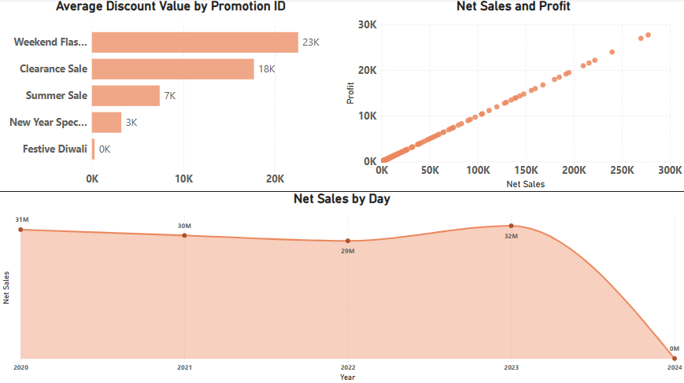
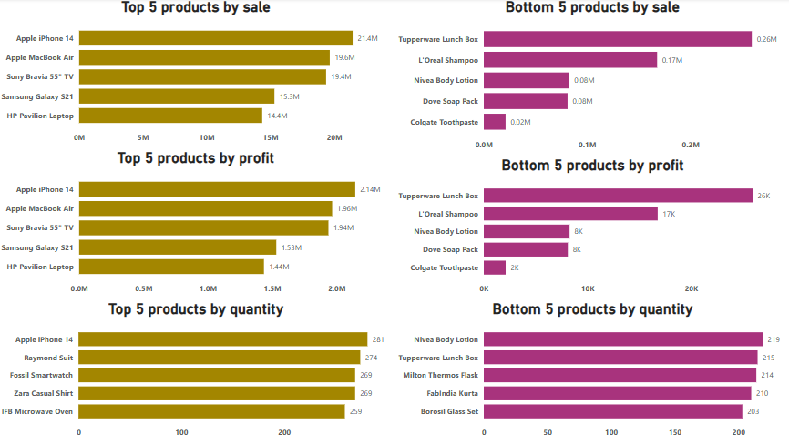
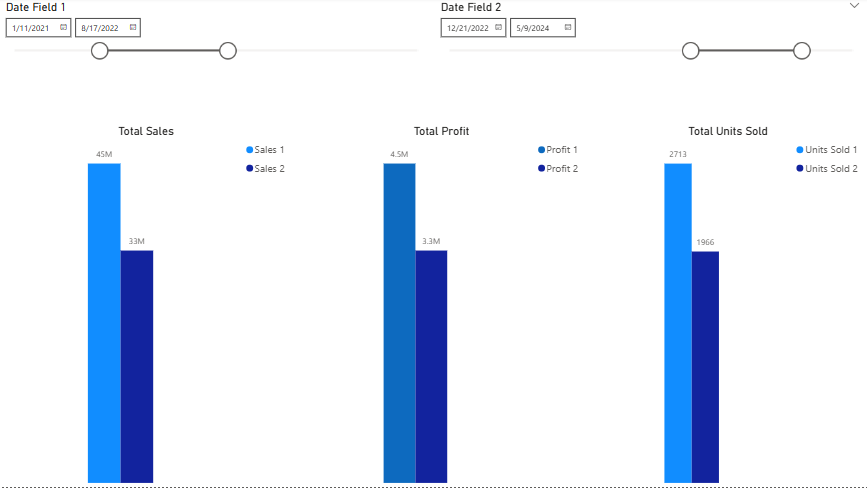
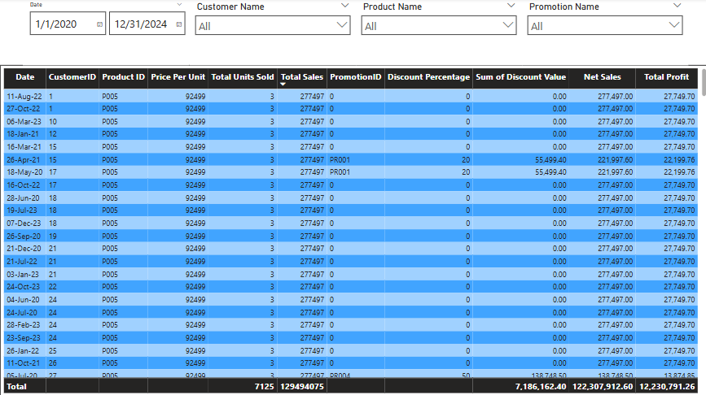

# 📊 E-Commerce Sales Report - Data Analysis

## 🖼️ Demo

## 📈 Generated Sales Trends:
- **Average Discount by PromotionID:**  
  - Most discounts are offered on **Weekend Flash Sale**
  - Least discounts are offered on **Festive Diwali**

- **Net Sales & Profit:**  
  - Both have a linear upward tragectory 

- **Net Sales by Year, Quarter, Month & Day:**
  - Orders peaked in the year 2023
  - Orders peaked in quarter 4 & bottomed in the 2nd quarter
  - Octobers on avg have the highest sale and April & December the lowest

- **Top 5 Products by Sale, Profit & Quantity:**  
  - Apple iphone 14 is the most sold & profitable item
  - The quantity sold does not differentiate much for the top 5 products

- **Bottom 5 Products by Sale, Profit & Quantity:**  
  - Tupperware Lunch Box brings in the least sale & profit
  - The ratio of the most sold products & the least sold products is not significant

- **General Overview:**  
  - 5.55% discount is offered on total sales 

This analysis was performed using **Power BI**, showcasing key metrics and trends for optimizing business decisions.
